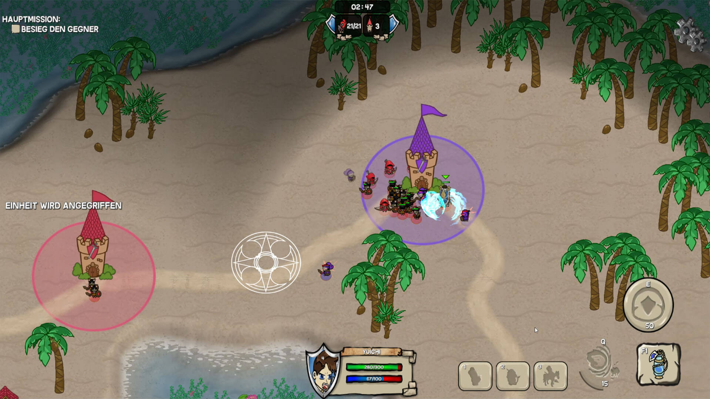
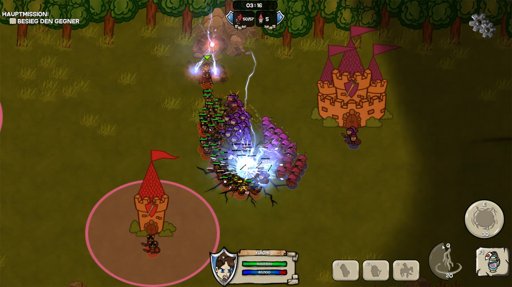

In towers, you can command heroes with powerful abilities. Each hero has 2 abilities. 

In addition, you can equip your heroes with unique skins and make them look the way you want.

We have 2 different heroes.

Torin is a more defensive Hero like a templar.
He has two Skills Knockback and a Protective Dome.

Health: 300
Armor:  70
Damage: 20

Knockback:
Deals 30 Damage and knocks back the Units.

Protective Dome:
Shields the Hero and the Units for 15 seconds and give them 50 more defense.

Ion is a lightning damage dealer like a mage.
His two Skills are Thunder Strike and Electronic Impact.

Health: 300
Armor:  40
Damage: 30

Thunder Strike:
Deals 300 damage to an aoe field of choice

Electronic Impact:
Deals 40 Damage but stuns all Units around him.

